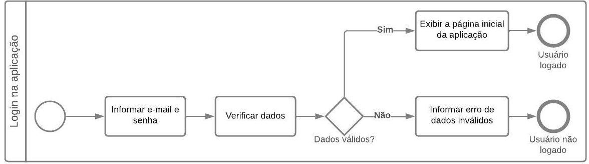
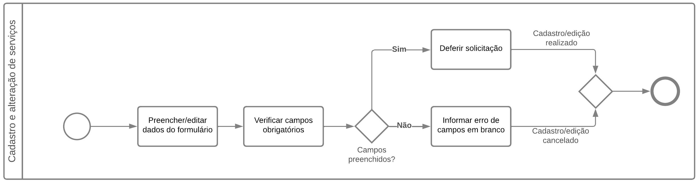
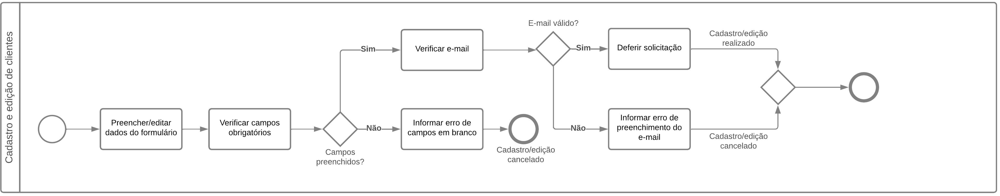
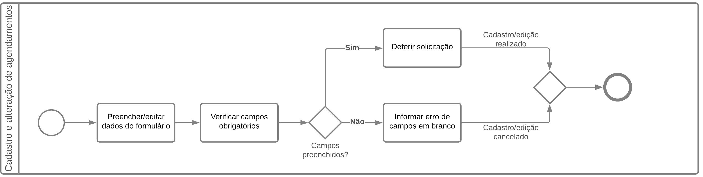
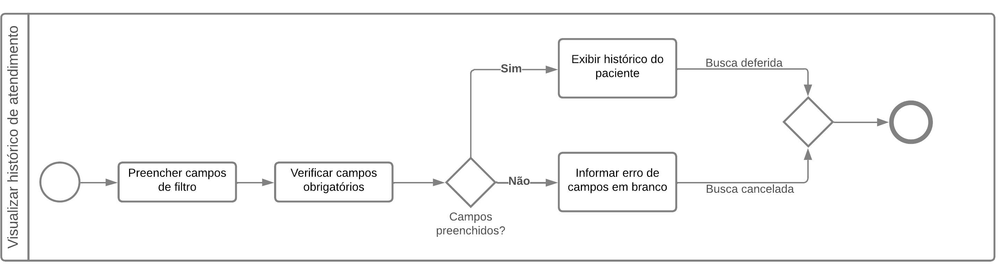

### **Modelagem de processos**
Utilizando a notação para modelagem de processos de negócio BPMN, é realizado o mapeamento dos principais processos, visando documentar os serviços realizados de ponta a ponta. A notação gráfica *Business Process Model and Notation* (BPMN) permite descrever, visualizar e comunicar os processos de negócio de forma clara e concisa. A seguir será apresentado cada um dos mapeamentos realizados.

#### **5.3.2.1 Processo: Login na aplicação**
O processo de verificação das credenciais dos usuários é um dos mais importantes para a aplicação, responsável por garantir que apenas usuários autenticados e autorizados tenham acesso aos recursos e funcionalidades. Neste projeto, o processo de login tem ainda mais importância, considerando o fato de que a aplicação visa armazenar e gerenciar dados sigilosos dos pacientes, requerendo mais segurança e confiabilidade no processo. Na Figura 4 é apresentado o fluxo deste processo.

**Figura 5. BPMN: Cadastro e edição de colaboradores**
#### **5.3.2.3 Processo: Cadastro e edição de serviços**
Na Figura 6 é apresentado o mapeamento do processo de cadastro ou edição dos tipos de serviços que são realizados pelo profissional. É possível que um mesmo profissional faça o cadastro de vários serviços, os diferenciando em duração das consultas e valor de cada uma.

**Figura 6. BPMN: Cadastro e edição de serviços**
#### **5.3.2.3 Processo: Cadastro e edição de horários**
Uma vez cadastrado o serviço, o colaborador necessita cadastrar os horários em que serão realizados os agendamentos daquele serviço. Através do mapeamento apresentado na Figura 7, é possível visualizar o fluxo do processo de cadastro de edição dos horários, possibilitando que o profissional especifique os dias da semana que irá realizar um serviço específico e ainda definir o espaço de tempo disponível para marcação daquele serviço.

**Figura 8. BPMN: Cadastro e edição de clientes**
#### **5.3.2.5 Processo: Cadastro e edição de agendamentos**
É neste processo que os psicólogos podem realizar marcações de agendamentos realizados pelos pacientes. Estes agendamentos servem como base para exibição do calendário do psicólogo e também para o controle dos pagamentos das consultas, onde o colaborador pode definir se a consulta foi paga ou não. A Figura 9 apresenta o mapeamento deste processo.

**Figura 9. BPMN: Cadastro e edição de agendamentos**
#### **5.3.2.5 Processo: Visualização da agenda de atendimento**
Possibilitando o acompanhamento de suas consultas em tempo real, este processo é responsável por apresentar ao colaborador um calendário exibindo cada uma das consultas existentes. Apresentado na Figura 10, o processo de visualizar a agenda de atendimento é um dos mais importantes da aplicação.

**Figura 10. BPMN: Visualizar agenda de atendimento**
#### **5.3.2.5 Processo: Visualização do histórico de atendimento**
Apresentado na Figura 11, o processo de visualizar o histórico de atendimento permite que o colaborador visualize, sempre que necessário, todo o histórico de consultas realizado por um paciente em um determinado período, contendo as anotações e informações de cada uma das consultas.

**Figura 11. BPMN: Visualizar histórico de atendimento**
### **5.3.1 Diagrama Entidade Relacionamento**
Para a produção do diagrama de entidade e relacionamento do banco de dados da aplicação, é utilizado o Modelo Entidade Relacionamento (MER), que tem o objetivo de descrever a estrutura lógica de um banco de dados de forma gráfica, utilizando entidades, atributos e relacionamentos. Este diagrama tem o objetivo de fornecer uma representação visual clara dos dados que serão armazenados em um banco de dados. A Figura 12 apresenta os relacionamentos da aplicação.

**Figura 12. Diagrama Entidade Relacionamento**
### **5.3.1 Diagrama de classes**
Este diagrama, assim como o diagrama de caso de uso, utiliza da linguagem UML para sua apresentação. O diagrama de classes cria uma representação visual das classes, objetos, atributos e métodos da aplicação, bem como das relações entre eles. Assim como os demais diagramas apresentados anteriormente, o diagrama de classes irá auxiliar na visualização e compreensão do projeto, apresentando de forma clara como a aplicação funcionará. A Figura 13 apresenta o diagrama de classes da aplicação.

