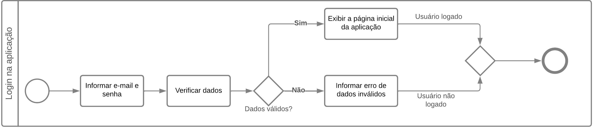

### **Modelagem de processos**
Utilizando a notação para modelagem de processos de negócio BPMN, é realizado o mapeamento dos principais processos, visando documentar os serviços realizados de ponta a ponta. A notação gráfica *Business Process Model and Notation* (BPMN) permite descrever, visualizar e comunicar os processos de negócio de forma clara e concisa. A seguir será apresentado cada um dos mapeamentos realizados.

#### **Processo: Login na aplicação**
O processo de verificação das credenciais dos usuários é um dos mais importantes para a aplicação, responsável por garantir que apenas usuários autenticados e autorizados tenham acesso aos recursos e funcionalidades. Neste projeto, o processo de login tem ainda mais importância, considerando o fato de que a aplicação visa armazenar e gerenciar dados sigilosos dos pacientes, requerendo mais segurança e confiabilidade no processo. Na figura abaixo é apresentado o fluxo deste processo.

#### **Processo: Cadastro e edição de colaboradores**
Este processo é restrito aos administradores do sistema e é responsável pelo registro de novos colaboradores (psicólogos) ou edição de seus dados. A partir desse ponto, o colaborador cadastrado tem acesso às funcionalidades da aplicação. A figura abaixo apresenta o mapeamento deste processo.

#### **Processo: Cadastro e edição de serviços**
Abaixo é apresentado o mapeamento do processo de cadastro ou edição dos tipos de serviços que são realizados pelo profissional. É possível que um mesmo profissional faça o cadastro de vários serviços, os diferenciando em duração das consultas e valor de cada uma.

#### **Processo: Cadastro e edição de clientes**
Este processo é onde os colaboradores podem registrar os seus clientes na aplicação. É neste processo que os psicólogos podem cadastrar e gerenciar seus pacientes, podendo ainda definir se aquele paciente está ativo ou inativo.

#### **Processo: Cadastro e edição de agendamentos**
É neste processo que os psicólogos podem realizar marcações de agendamentos realizados pelos pacientes. Estes agendamentos servem como base para exibição do calendário do psicólogo e também para o controle dos pagamentos das consultas, onde o colaborador pode definir se a consulta foi paga ou não. A figura abaixo apresenta o mapeamento deste processo.

#### **Processo: Cadastro e edição de agendamentos**
É neste processo que os psicólogos podem realizar marcações de agendamentos realizados pelos pacientes. Estes agendamentos servem como base para exibição do calendário do psicólogo e também para o controle dos pagamentos das consultas, onde o colaborador pode definir se a consulta foi paga ou não. A figura abaixo apresenta o mapeamento deste processo.

#### **Processo: Visualização da agenda de atendimento**
Possibilitando o acompanhamento de suas consultas em tempo real, este processo é responsável por apresentar ao colaborador um calendário exibindo cada uma das consultas existentes. Apresentado na figura abaixo, o processo de visualizar a agenda de atendimento é um dos mais importantes da aplicação.

#### **Processo: Visualização do histórico de atendimento**
Apresentado na figura abaixo, o processo de visualizar o histórico de atendimento permite que o colaborador visualize, sempre que necessário, todo o histórico de consultas realizado por um paciente em um determinado período, contendo as anotações e informações de cada uma das consultas.

**Diagrama Entidade Relacionamento**
Este diagrama, assim como o diagrama de caso de uso, utiliza da linguagem UML para sua apresentação. O diagrama de classes cria uma representação visual das classes, objetos, atributos e métodos da aplicação, bem como das relações entre eles. Assim como os demais diagramas apresentados anteriormente, o diagrama de classes irá auxiliar na visualização e compreensão do projeto, apresentando de forma clara como a aplicação funcionará. A figura abaixo apresenta o diagrama de classes da aplicação.

